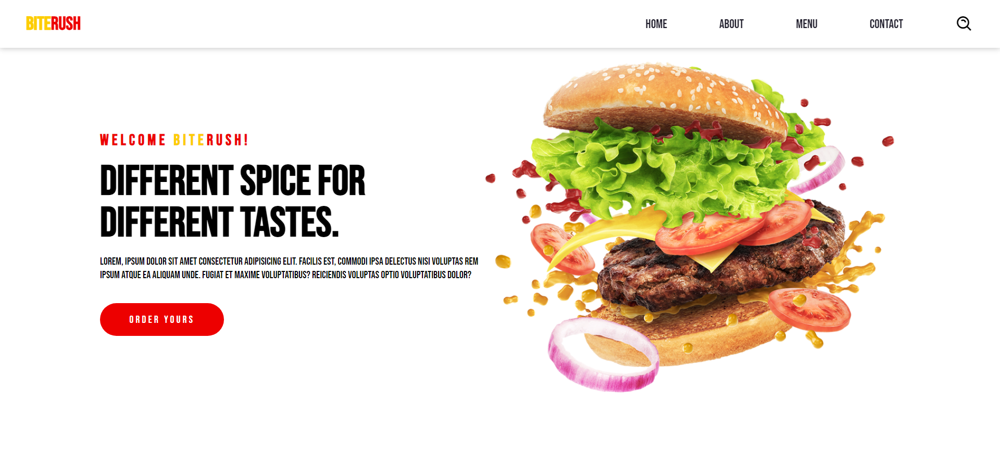

<p align="center"></p>
<h2 align = "center">BiteRush | 🍕 Projeto de Página de Restaurante</h2>

 <!-- Substitua pela URL correta da imagem de pré-visualização -->

## 📋 Descrição do Projeto

O **BiteRush** é uma página voltada para restaurantes que permite aos usuários visualizarem o menu e obterem informações sobre o local. O site foi construído com HTML para a estruturação, CSS para estilização e JavaScript para funcionalidades interativas. O objetivo é proporcionar uma experiência intuitiva e visualmente atraente aos visitantes.

## 🔧 Tecnologias Utilizadas

- **HTML5** - Para a estrutura do conteúdo
- **CSS3** - Para a estilização e layout responsivo
- **JavaScript** - Para interatividade e funcionalidades dinâmicas

## 🚀 Funcionalidades

- Exibição de menu com imagens dos pratos
- Layout responsivo para se adaptar a diferentes dispositivos
- Navegação fluida com JavaScript

## 📂 Estrutura de Pastas

```bash
biteRush/
│
├── assets/                # Pasta de ativos
│   ├── css/               # Estilos do projeto
│   │   ├── style.css      # Arquivo principal de estilos
│   │   ├── vars.css       # Variáveis de CSS
│   │   └── media-queries.css  # Estilos responsivos
│   ├── images/            # Imagens do projeto
│   └── js/                # Scripts JS do projeto
│       └── script.js      # Arquivo principal de JavaScript
│
├── index.html             # Página inicial
└── README.md              # Documentação do projeto
```

## 🖥️ Como Rodar o Projeto Localmente

1. Clone o repositório:

```bash
git clone https://github.com/sarahbeirigo/biteRush.git
```

2. Navegue até o diretório do projeto:

```bash
cd biteRush
```

3. Abra o arquivo `index.html` diretamente no navegador para visualizar o site.

## ✍️ Aprendizado

Nesse projeto, desenvolvi habilidades em:

- Criação de layouts responsivos utilizando **media queries**
- Modularização de estilos com **CSS custom properties**
- Interatividade com **JavaScript** para melhorar a experiência do usuário

## 💡 Melhorias Futuras

- Adicionar animações mais complexas utilizando JavaScript
- Implementar um sistema dinâmico para pedidos online
- Melhorar a acessibilidade e performance
- Adicionar mais páginas e mais funcionalidades

## 📝 Contato

Se você quiser saber mais sobre o projeto ou entrar em contato:

<a href = "mailto:sarahcbeirigo@gmail.com"></a>
<a href="https://www.linkedin.com/in/sarah-beirigo/" target="_blank"></a>

<p align="center">👩🏼‍💻 coded by <a href="https://github.com/sarahbeirigo">Sarah Beirigo</a></p>
